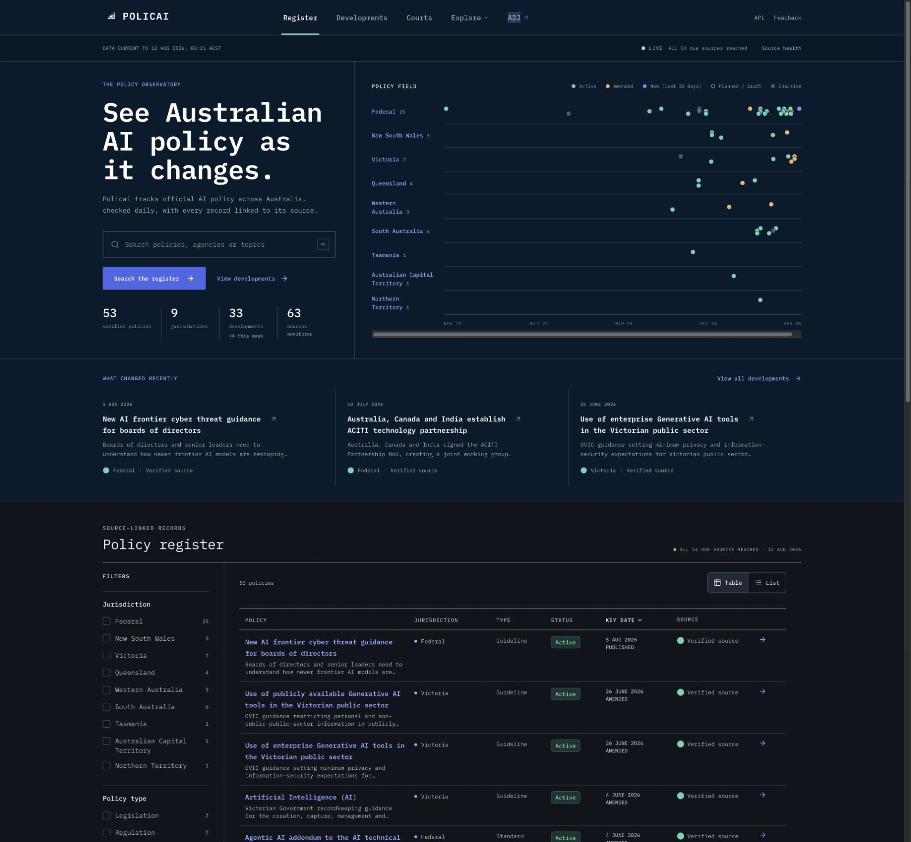
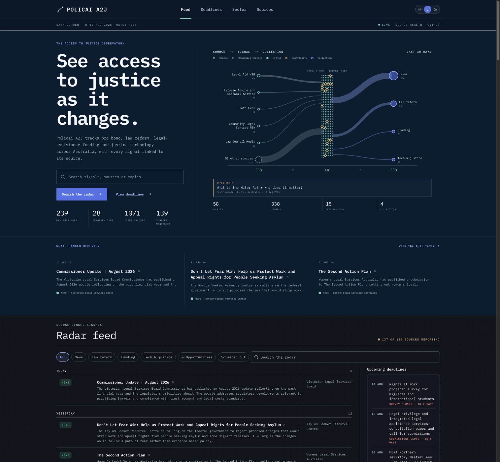
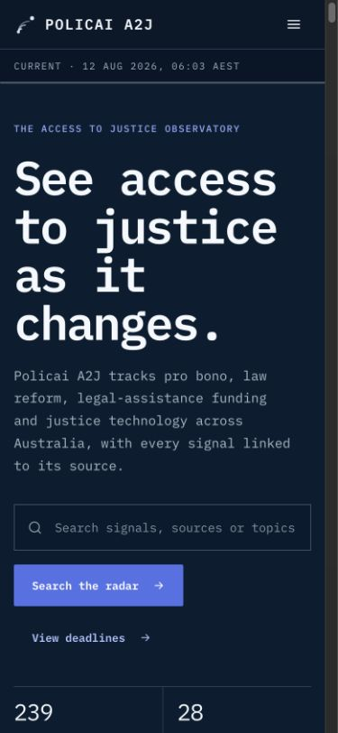
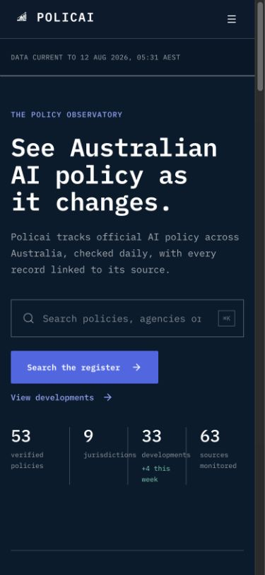
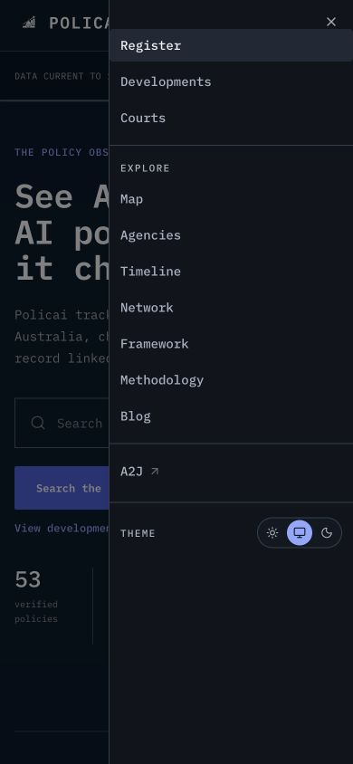
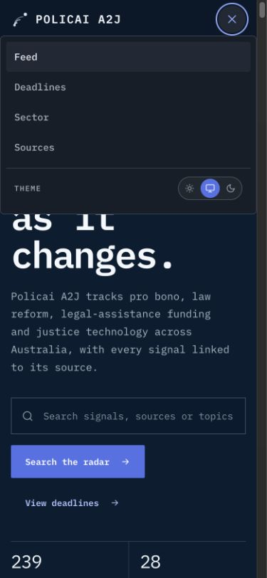
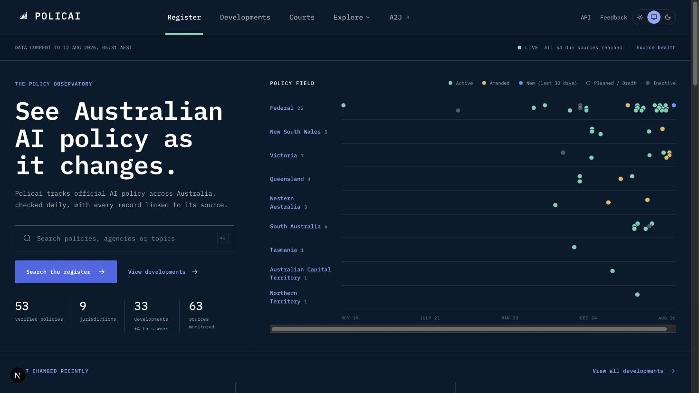
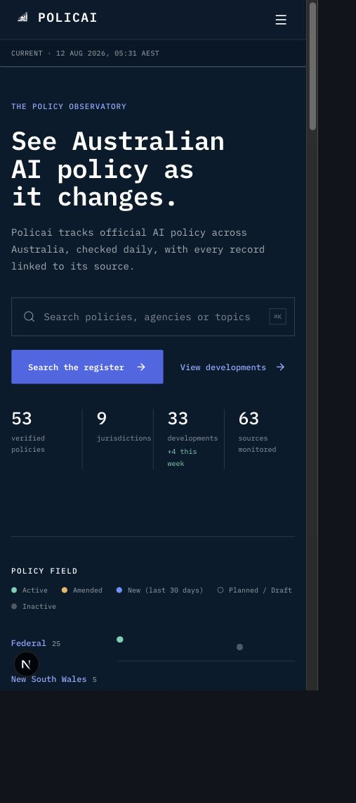
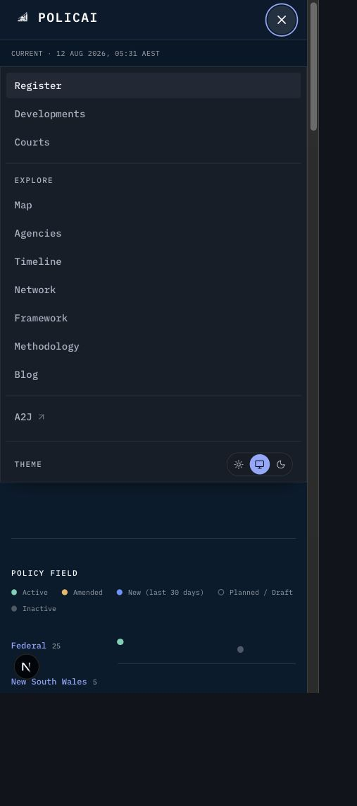

# Policai and Policai A2J UI/UX audit

Date: 12 August 2026
Scope: public home screens, shared masthead, dateline, theme control, mobile navigation, cross-property navigation, and responsive reflow.

## User goal and accessibility target

Readers should be able to identify which Policai property they are using, change theme, move between the two observatories, and reach the primary content quickly on desktop and mobile. The audit checks visible UX and DOM-accessible structure; it is not a full WCAG conformance assessment.

## Strengths

- Both properties already share the strongest visual foundations: IBM Plex Mono, navy observatory hero, restrained rules, mint live status, blue primary action, compact metadata, and source-linked content.
- The desktop hierarchy is clear: property identity, primary navigation, data freshness, hero task, then the live register/feed.
- Search fields, primary actions, skip links, navigation landmarks, theme radios, and content links have accessible names in the captured DOM.
- The A2J signal network exposes an accessible image label and individual source/signal links rather than relying on a visual-only chart.

## Findings from the live capture

1. **P1 — Theme control was inconsistent.** A2J exposed the three-way Light/System/Dark control in the desktop masthead; Policai exposed it only inside the mobile menu. This made a shared site preference discoverable on one property but hidden on the other.
2. **P1 — Mobile navigation behaved differently.** Policai opened a right-side Sheet; A2J opened an inline dropdown below the masthead. Both were usable, but the same publication family had different menu geometry, close affordance, and motion model.
3. **P2 — Mobile datelines used different language and height.** A2J condensed to `CURRENT · …`; Policai retained the longer `DATA CURRENT TO …` label and a taller strip, shifting the hero down.
4. **P2 — Property switching was one-way in the header.** Policai linked to A2J from primary navigation; A2J linked back only from its footer, making the relationship less discoverable from the top of the page.

## Changes applied

- Policai now shows the same desktop theme control treatment as A2J.
- Policai now uses the A2J-style inline mobile navigation pattern, with matching `Open menu`/`Close menu` labels, `aria-expanded`, theme row, and full-width panel.
- Policai now uses the compact mobile dateline and matching strip height.
- A2J now links back to Policai from both desktop and mobile primary navigation with the same external-property arrow treatment used by Policai.
- Product-specific labels and information architecture remain unchanged: Register/Developments/Courts/Explore on Policai, and Feed/Deadlines/Sector/Sources on A2J.

## Evidence

### Live desktop reference captures

### Live mobile reference captures

### Local post-change evidence

## Accessibility risks and verification gaps

- The captured DOM confirms named controls and navigation landmarks, but contrast ratios, screen-reader announcements, focus return after closing a menu, and keyboard traversal across every route still need a dedicated accessibility pass.
- The visualisations communicate categories with colour plus text labels; verify the same meaning in forced-colours mode and with non-colour perception settings.
- A2J's local data-backed preview could not boot because `DATABASE_URL` is not set in this workspace. Its production build passed, and the live A2J reference was captured successfully.

## Verification

- Policai: `npm run check` passed — 39 test files, 472 tests, data validation with 0 errors, and production build completed. Validation emitted the repository's existing three editorial-review warnings.
- A2J dashboard: `npm run build` passed.
- The local Policai desktop and mobile DOM/screenshot checks confirmed the desktop theme radios, compact dateline, reciprocal navigation, and aligned mobile menu state.

## Recommendations

1. Keep the masthead contract documented in both repositories until the two properties can share a small shell package or generated token contract.
2. Run one focused keyboard/screen-reader pass before the next public release, especially for the mobile menu and interactive SVG/network content.
